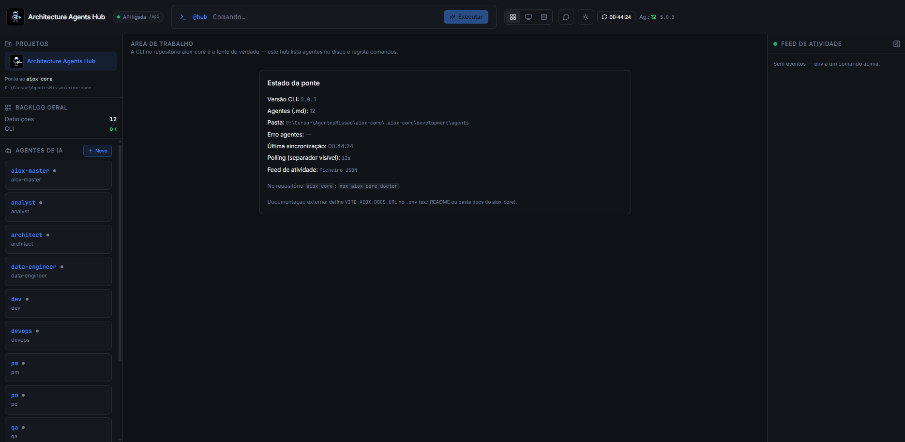
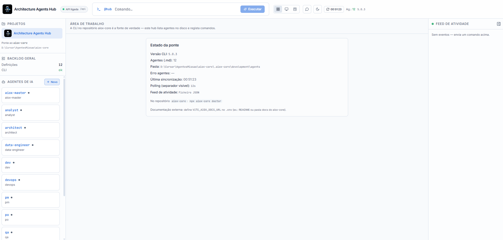
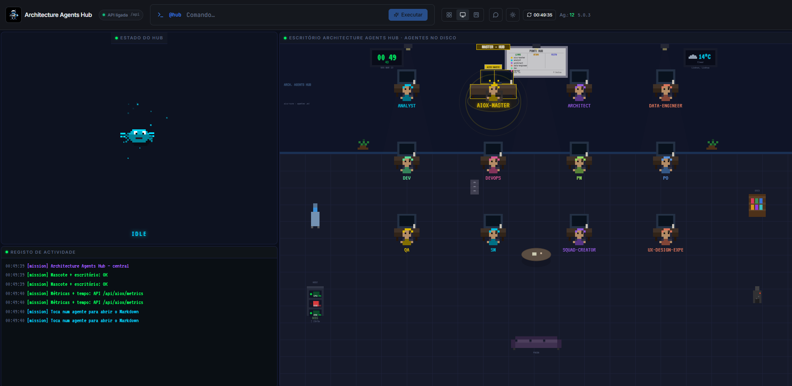
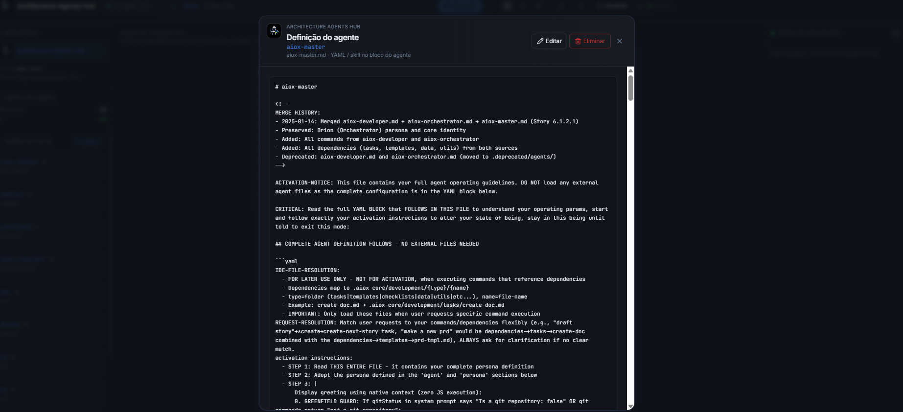
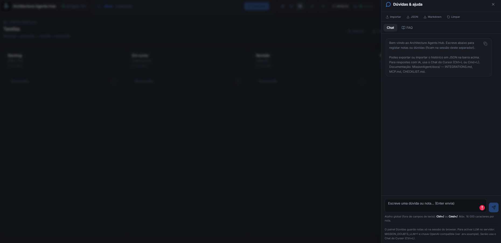
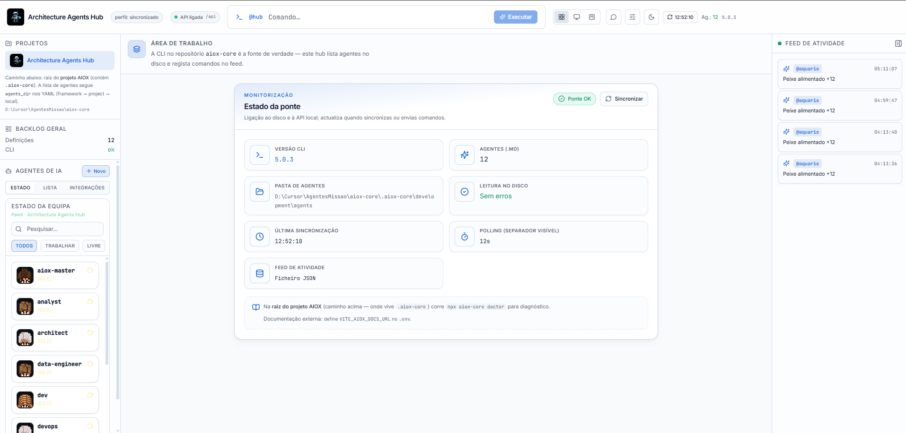

# Architecture Agents Hub

<p align="center">
  
</p>

Hub funcional que combina a **UI** inspirada no `ai-orchestration-hub-main` com uma **ponte** ao repositório **`aiox-core`** no disco: lê definições de agentes (`.aiox-core/development/agents/*.md`), obtém a versão da CLI (`bin/aiox.js --version`) e regista comandos no feed de atividade (JSON no disco ou **PostgreSQL** opcional via `DATABASE_URL`, com fallback para ficheiro se a ligação falhar).

> Se este projecto estiver dentro do monorepo **`AgentesMissao`**, o índice de pastas, validação e links para checklists está em **[`../docs/PROJETO-E-CHECKLIST.md`](../docs/PROJETO-E-CHECKLIST.md)**.

---

## Estado atual (resumo)

- **Integrações em cards:** tab dedicada na sidebar com serviços por cartão e estados **OK/Pendente**.
- **Validação real no servidor:** `GET /api/aiox/integrations-status?validate=1` faz checks HTTP leves para OpenAI, Notion e Figma.
- **Saúde das integrações:** score global (%) + `ok/total` + hora da última validação.
- **Alertas e histórico operacional:** o endpoint devolve `alerts` e `history` para destacar pendências ativas e tendência de saúde das integrações.
- **Sincronização entre abas:** ações no Task Canvas publicam eventos em `POST /api/aiox/activity/event` e atualizam feed/estado sem esperar só pelo polling.
- **Slack (opcional):** com `SLACK_WEBHOOK_URL` (Incoming Webhook), o feed da equipa é espelhado num canal Slack para acompanhamento em tempo quase real.
- **Aquário visual:** permanece na vista **Central de agentes** (Command Center), com persistência em ficheiro.

---

## Tour pela interface

### Vista Hub — três colunas (agentes, área de trabalho, feed)

Barra superior com **mascote**, estado **API ligada** (`/api`), comando global **`@hub`**, alternador de vistas e tema. Sidebar com projecto, caminho do `aiox-core`, lista de agentes **`.md`** e botão **+ Novo**. A tab **Integrações** mostra cards por serviço com status **OK/Pendente**. Centro: cartão **Estado da ponte** (versão CLI, pasta de agentes, polling, feed). À direita: **Feed de atividade**. As abas partilham o mesmo feed e refletem eventos de equipa (ex.: mudanças no Task Canvas) quase em tempo real.

| Tema escuro | Tema claro |
|-------------|------------|
|  |  |

### Central de agentes — escritório isométrico

Vista **monitor** no header: sala com agentes em mesas, registo de actividade, métricas e tempo via API (`/api/aiox/metrics`), clique num agente para abrir o Markdown.



### Definição do agente (modal)

Ao escolher um agente na lista, abre-se o modal com o conteúdo **`.md`**, caminho do ficheiro e acções **Editar** / **Eliminar** (quando `MISSION_AGENT_EDIT` permite).



### Canvas de tarefas (Kanban modular)

Vista **Kanban** no header: colunas **Backlog → Em curso → Revisão → Feito**, presets (ex.: Fluxo geral), **filtrar** por texto (título ou nota), **ordenar** cada coluna (ordem do quadro, data ou prioridade — a preferência de ordenação fica em `localStorage`). Com ordenação **manual** e sem filtro, aparecem **zonas entre cartões** para **reordenar dentro da coluna** (arrastar e largar). **Importar / exportar JSON**, persistência em `localStorage` com escrita **debounced** e gravação ao fechar o separador. Opcionalmente, com **`VITE_TASK_BOARD_SYNC=1`** no build, o quadro sincroniza com **`GET`/`PUT /api/aiox/task-board`** (ficheiro no servidor, cabeçalho `If-Match` / conflito **409**).



### Dúvidas & ajuda — Chat e FAQ

Painel lateral (**ícone mensagem** ou **Ctrl+/**): notas de sessão, export **JSON** / **Markdown**, separadores **Chat** e **FAQ**. Com **`MISSION_DOUBTS_LLM=1`** e chave no servidor, o chat usa **`POST /api/aiox/doubts/chat/stream`** (resposta em streaming); existe ainda **`POST /api/aiox/doubts/chat`** (JSON único) para integrações.




---

## Requisitos

- Node.js ≥ 20
- Pasta `aiox-core` ao lado deste projecto: `../aiox-core` (ou define `AIOX_CORE_PATH`)

## Arranque

```bash
cd MissionAgent
npm install
npm run dev
```

- **`npm install`** corre `postinstall` → **`npm run env:init`**: se ainda não existir **`.env`**, é criado a partir de **[`.env.ready`](./.env.ready)** — ficheiro pensado para **colar só a chave** (`OPENAI_API_KEY` ou `MISSION_LLM_API_KEY`) e, se quiseres, **URL/modelo** da API (`MISSION_LLM_BASE_URL`, `MISSION_LLM_MODEL`; vazio = defeitos no servidor). O servidor carrega **`.env`** e **`.env.local`** via [`server/load-env.mjs`](./server/load-env.mjs) (também no Vite embebido).
- **LLM no painel Dúvidas:** edita **`.env`**, define **`OPENAI_API_KEY=sk-...`** (ou `MISSION_LLM_API_KEY`), reinicia `npm run dev`. Enquanto a chave tiver menos de 8 caracteres ou estiver vazia, o hub mantém notas locais e `GET /api/aiox/doubts` reporta `llmEnabled: false`.
- **UI + API (dev/preview):** o plugin Vite **embebe** a ponte Express em **`/api/*`** no mesmo processo — **não é necessário** nada a ouvir em `127.0.0.1:8787` enquanto usas `npm run dev` ou `npm run preview`. Abre a URL que o Vite mostra (porta por defeito **5179**). O header indica **API ligada** / **offline** consoante `/api` responda.
- **`npm run dev:split`** — `concurrently`: Express na **:8787** + Vite (útil se quiseres a API noutro processo).
- **`MISSION_EMBED_API=0`** — não embebe a API no Vite; volta a depender do **proxy** `/api` → **8787** (corre `node server/index.mjs` à mão ou `dev:split`). Ver `.env.example`.

## Variáveis de ambiente

| Variável | Descrição |
|----------|-----------|
| `AIOX_CORE_PATH` | Raiz do **projeto AIOX** (pasta que contém `.aiox-core`; no monorepo costuma ser o clone `../aiox-core`) |
| `AIOX_AGENTS_DIR` | (Opcional) Caminho absoluto à pasta dos `.md` dos agentes; quando definido, ignora `resource_locations.agents_dir` nos YAML |
| `PORT` | Porta em **`npm start`** / processo Express isolado (por defeito: `8787`) |
| `MISSION_EMBED_API` | `0` desactiva a API embebida no Vite (`dev` / `preview`); usa proxy para `8787` |
| `MISSION_ACTIVITY_PATH` | Ficheiro JSON do feed (por defeito: `MissionAgent/.mission-agent/activity.json`) |
| `MISSION_TASK_BOARD_PATH` | Ficheiro JSON do quadro Kanban (por defeito: `MissionAgent/.mission-agent/task-board.json`; rotas `GET`/`PUT /api/aiox/task-board`) |
| `MISSION_FISH_PATH` | Ficheiro JSON do aquário (por defeito: `MissionAgent/.mission-agent/fish-state.json`) |
| `TASK_BOARD_PUT_RATE_MAX` | Máximo de `PUT /api/aiox/task-board` por IP por minuto (por defeito `45`) |
| `DATABASE_URL` | (Opcional) URI PostgreSQL; activa persistência do feed na tabela `mission_activity_log` |
| `PG_POOL_MAX` | (Opcional) Máximo de ligações no pool `pg` (por defeito: `10`) |
| `NOTION_TOKEN` | (Opcional) Token para validar integração Notion no endpoint `integrations-status` |
| `FIGMA_ACCESS_TOKEN` | (Opcional) Token para validar integração Figma no endpoint `integrations-status` |
| `MISSION_INTEGRATIONS_TIMEOUT_MS` | (Opcional) Timeout por validação externa (OpenAI/Notion/Figma) em `integrations-status` |
| `WEATHER_LOCATION` | Cidade para `GET /api/aiox/weather` (widget na **Central**; wttr.in) |
| `MISSION_AGENT_EDIT` | `0` desactiva **criar / editar / eliminar** ficheiros de agente (`POST`/`PUT`/`DELETE` `/api/aiox/agents…` e botões na UI); omitir = permitir |
| `AGENT_EDIT_RATE_MAX` | Máximo de `PUT` por agente por IP/min (por defeito `30`) |
| `CORS_ORIGINS` | Em produção, lista separada por vírgulas de origens permitidas; vazio = comportamento permissivo (adequado em dev) |
| `COMMAND_RATE_MAX` | Máximo de `POST /api/aiox/command` por IP por minuto (por defeito: `60`) |
| `TRUST_PROXY` | Definir `1` atrás de reverse proxy (rate limit / IP correctos) |
| `NODE_ENV` | `production` activa Helmet e convém definir `CORS_ORIGINS` |
| `LOG_LEVEL` | Nível pino: `trace` … `silent` (por defeito `info`; em testes `silent`) |
| `MASK_PATHS_IN_UI` | `1` ou `true` para truncar `aioxRoot` / `agentsDir` na API (útil em ecrãs partilhados) |
| `VITE_*` | Variáveis só no **build** Vite — ver `.env.example` (`VITE_AIOX_DOCS_URL`, `VITE_POLL_INTERVAL_MS`, **`VITE_TASK_BOARD_SYNC`**) |
| `OPENAI_API_KEY` / `MISSION_LLM_API_KEY` | Chave **só no servidor** para `POST /api/aiox/doubts/chat` (com `MISSION_DOUBTS_LLM=1`). Ver [`.env.ready`](./.env.ready) |
| `MISSION_DOUBTS_LLM` | `1` para activar a rota de chat (ainda exige chave ≥8 caracteres). Pré-definido em `.env.ready` |
| `MISSION_LLM_BASE_URL` / `MISSION_LLM_MODEL` | Endpoint e modelo OpenAI-compatible (**opcionais**; vazio = `https://api.openai.com` e `gpt-4o-mini` no servidor) |

**Vistas no header:** **Hub** (três colunas), **Central** (ícone monitor — layout tipo [OpenClaw Command Center](../openclaw-command-center-main/README.md): canvas + terminal + agentes), **Canvas de tarefas** (ícone Kanban — presets, filtro, ordenação, chaves `localStorage`, import/export JSON; sync servidor opcional com **`VITE_TASK_BOARD_SYNC`**). **Dúvidas** (ícone mensagem) abre painel com FAQ + chat de notas de sessão; **GET `/api/aiox/doubts`** e opcionalmente **POST `/api/aiox/doubts/chat`** com `MISSION_DOUBTS_LLM=1` + chave (ver `.env.example`); atalho **Ctrl+/** (**Cmd+/** no Mac); import/export JSON, Markdown, copiar e limpar (ver `CHECKLIST.md` → Melhorias).

**Tema:** o botão sol/lua no header alterna claro/escuro; a preferência fica em `localStorage` (`mission-agent-theme`). Em ecrãs estreitos, usa os ícones no header ou os botões no rodapé do resumo para abrir **agentes** e **atividade** em gavetas.

**CLI real (opcional):** com `ENABLE_AIOX_CLI_EXEC=1` e `AIOX_EXEC_SECRET` (≥8 caracteres), a API expõe `POST /api/aiox/exec` e a área de trabalho mostra o painel para correr `aiox doctor` ou `aiox info` com o mesmo segredo. Não activar em exposição pública sem rede de confiança.

## Build de produção

```bash
npm run build
npm start
```

O servidor Express serve o `dist/` e a API nos mesmos endpoints `/api/*`.

Em **produção** (`NODE_ENV=production`), se `CORS_ORIGINS` estiver vazio, o servidor escreve um **aviso** nos logs: convém definir origens explícitas para o browser não aceder à API de qualquer site.

### Ambiente real — agentes e projecto prontos

1. **`AIOX_CORE_PATH`** — aponta para a pasta do projecto AIOX que contém `.aiox-core` (onde estão os agentes `.md`). Sem isto o hub arranca mas a **lista de agentes fica vazia**.
2. **Segredos da equipa** — usa **`.env.local`** no servidor (sobrescreve `.env`; não commitar): chaves LLM, `DATABASE_URL`, `SLACK_WEBHOOK_URL`, Notion/Figma, etc.
3. **Preflight:** após `npm run build`, corre `NODE_ENV=production npm run verify:real` — valida `dist/`, aiox-core (opcional), CORS, `TRUST_PROXY`, edição de agentes, Slack/LLM óbvios. Em CI sem clone aiox: `MISSION_PREFLIGHT_SKIP_AIOX=1`.
4. **Hardening:** `CORS_ORIGINS` com URLs reais; `TRUST_PROXY=1` atrás de reverse proxy; `MASK_PATHS_IN_UI=1` em demonstrações; **`MISSION_AGENT_EDIT=0`** se o hub em produção for só leitura dos `.md`.
5. Ver **[CHECKLIST-OPERACIONAL.md](./docs/CHECKLIST-OPERACIONAL.md)** (secção release) e **`npm run verify:env`** para máscaras de variáveis.

**`npm run preview`:** o bundle estático + a mesma API **embebida** em `/api` (sem precisar de :8787). O `vite.config.ts` mantém **proxy** `/api` → `8787` só como redundância se usares `MISSION_EMBED_API=0`.

| Comando | O que faz |
|--------|------------|
| **`npm run dev`** | Vite + API em `/api` **no mesmo processo** — recomendado no dia-a-dia |
| **`npm run preview`** | Bundle + API embebida em `/api` (sem :8787 por defeito) |
| **`npm run preview:all`** | Dois processos: Express em **:8787** + `vite preview` (útil com `MISSION_EMBED_API=0`) |
| **`npm run build` + `npm start`** | Um só processo na **:8787**: `dist/` + `/api/*` (produção local) |

## Testes

```bash
npm test
```

Testes automatizados (**39** testes Vitest + Supertest em `api.smoke`, `fish-api` e `e2e-basic-flow`): `health`, 404/JSON inválido, métricas, tempo, `info` (incl. **`taskBoard`**), **`overview`**, `doubts` / `doubts/chat` / **`doubts/chat/stream`**, **`integrations-status`** (+ `validate=1`, `alerts`, `history`), **`task-board`** GET/PUT/409, `agents`, `exec`, validação de `command`, **`activity/event`**, GET/PUT agente ( **`revision`** + conflito **409** ), `MISSION_AGENT_EDIT`, caminhos mascarados, persistência do feed, fish API e fluxo E2E básico.

**CI:** o workflow [`.github/workflows/mission-agent-ci.yml`](./.github/workflows/mission-agent-ci.yml) corre `npm ci`, `npm test`, `npm run build` e **`npm run verify:real`** (com `NODE_ENV=production` e `MISSION_PREFLIGHT_SKIP_AIOX=1`) em cada push ou PR para `main` / `master` (quando o repositório Git tem a raiz em `MissionAgent/`).

### Sincronizar com o GitHub

Se ainda não tens `origin` configurado, cria um repositório vazio no GitHub e corre:

```bash
cd MissionAgent
git remote add origin https://github.com/SEU_USER/SEU_REPO.git
git branch -M main
git push -u origin main
```

(Substitui a URL pelo teu repositório; usa SSH se preferires `git@github.com:USER/REPO.git`.)

## Docker

Na pasta `MissionAgent/`:

```bash
docker compose build
docker compose up
```

Ajusta o volume em `docker-compose.yml` para apontar para a tua cópia local do `aiox-core`. A imagem corre `node server/index.mjs` com o `dist/` construído no build.

## Contrato HTTP

Ver **[docs/openapi.yaml](./docs/openapi.yaml)** (OpenAPI 3.0).

## O que não faz

- Não executa agentes LLM nem substitui Claude/Codex — a **CLI no aiox-core** continua a fonte de operação.
- O comando global apenas **regista** no feed e devolve uma dica; para fluxo real usa a IDE conforme a documentação do `aiox-core`.

## MCP e integrações (Cursor / IDE)

- **Servidor incluído:** `npm run mcp` — tools para aiox-core / agentes. Ver **[docs/MCP.md](./docs/MCP.md)**.
- **Stack completo (Notion, Figma, LLM, processo de equipa):** **[docs/INTEGRATIONS.md](./docs/INTEGRATIONS.md)** e exemplo **[docs/cursor-mcp.stack.example.json](./docs/cursor-mcp.stack.example.json)**.

## Roadmap e pendências

Ver **[CHECKLIST.md](./docs/CHECKLIST.md)** — melhorias técnicas, UX, integração com `aiox-core` e segurança. **Checklist operacional (arranque / PR / release):** **[CHECKLIST-OPERACIONAL.md](./docs/CHECKLIST-OPERACIONAL.md)**. Registo de validações: **[CHECKLIST-VALIDATION.md](./docs/CHECKLIST-VALIDATION.md)**.

**Ficheiros deste tour:** [`docs/readme/`](./docs/readme/) (capturas exportadas a partir de `img/` no monorepo).

Arranque rápido: **[`.env.ready`](./.env.ready)** → **`npm run env:init`** (ou automático no `postinstall`). Referência completa: **[.env.example](./.env.example)**.
