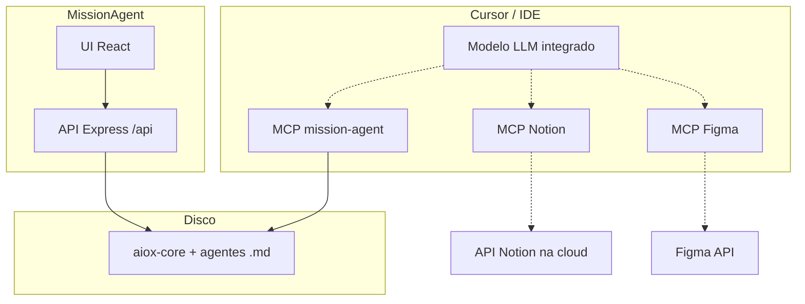

# Integrações — MCP, LLM, Notion, Figma

Este documento alinha **o que o repositório `MissionAgent` faz** com **o que se configura no Cursor / fora do código**.

## Visão geral

| Área | Onde se configura | O que o hub faz hoje |
|------|-------------------|----------------------|
| **MCP (Mission Agent)** | Cursor → MCP + `npm run mcp` | Servidor **stdio** com tools `mission_*` (ler aiox-core, listar agentes). Ver [MCP.md](./MCP.md). |
| **MCP (Notion, Figma, …)** | Cursor → MCP (servidores oficiais ou comunidade) | **Nada no Node** — o IDE agrega vários servidores MCP lado a lado. |
| **LLM** | Cursor (modelo), ou CLI/IDE no `aiox-core` | O hub **não aloja modelo LLM**; o comando global só **regista** no feed. Execução real continua na documentação do aiox-core / IDE. |
| **Painel Dúvidas (UI)** | — | Notas em `sessionStorage`; **GET `/api/aiox/doubts`** devolve capacidades; com `MISSION_DOUBTS_LLM=1` + chave OpenAI-compatible, **POST `/api/aiox/doubts/chat`**; `MISSION_DOUBTS_HELP_URL` → `docsUrl`. Ambiente local: **`.env.ready`** → `npm run env:init` / `postinstall` → `.env` + `server/load-env.mjs`. Ver `docs/openapi.yaml`, `server/lib/doubts-llm.mjs`. |
| **Notion (processo)** | Equipa + API Notion (fora deste repo) | Regra de equipa: actualizar base Notion **antes** de mudanças de escopo (ver secção abaixo). |
| **Figma (design)** | Cursor MCP Figma + ficheiro no Figma | Front-end deve seguir leitura MCP do ficheiro antes de implementar UI (política de fidelidade). |



## 1. MCP — servidor incluído no Mission Agent

- **Comando:** `npm run mcp` (na pasta `MissionAgent/`).
- **Configuração Cursor:** exemplo em [MCP.md](./MCP.md) (`mcpServers.mission-agent-aiox`).
- **Variáveis:** `AIOX_CORE_PATH` se o aiox-core não estiver em `../aiox-core`.

Não escrever logs em `stdout` durante a sessão MCP.

## 2. MCP — Notion, Figma e outros (stack no Cursor)

Estes servidores **não fazem parte** do `package.json` do Mission Agent: instalas/configuras no **Cursor** (Settings → MCP ou ficheiro JSON do projecto).

### Notion

1. Cria uma **integração** em [Notion Developers](https://developers.notion.com/) e obtém o **secret** (Internal Integration).
2. Partilha as páginas/bases com essa integração.
3. No Cursor, adiciona o servidor MCP Notion (o teu ambiente pode usar o pacote `user-Notion` ou o oficial, conforme versão do Cursor).
4. Mantém tokens **fora** do Git (variáveis de ambiente do MCP no Cursor, não em `.env` commitado).

### Figma

1. Gera um **Personal access token** em Figma (Settings → Security).
2. Configura o servidor MCP Figma no Cursor (há variantes community/official — segue a documentação actual do Cursor para “Figma MCP”).
3. Para **UI do hub**: usar o MCP para inspeccionar o ficheiro antes de alterar componentes React (fidelidade ao design).

### Exemplo mínimo (Mission Agent)

Ver **[cursor-mcp.stack.example.json](./cursor-mcp.stack.example.json)** — só o servidor incluído neste repo. Para **Notion** e **Figma**, adiciona entradas **em paralelo** no mesmo `mcpServers`:

- Abre **Cursor → Settings → MCP** e usa **Add server** com o assistente, **ou** cola JSON fornecido pela documentação oficial do Cursor para cada integração (os nomes de pacote `command`/`args` mudam com a versão).
- Define **sempre** tokens em variáveis `env` do servidor MCP no Cursor, não em ficheiros commitados.

Exemplo genérico (estrutura ilustrativa — não copiar pacotes à cega):

```json
"notion": {
  "command": "…",
  "args": ["…"],
  "env": { "OPENAPI_MCP_NOTION_API_KEY": "secret_…" }
},
"figma": {
  "command": "…",
  "args": ["…"],
  "env": { "FIGMA_ACCESS_TOKEN": "figd_…" }
}
```

## 3. LLM

| Cenário | Configuração |
|---------|----------------|
| **Chat / agente no Cursor** | Modelo e API keys em **Cursor Settings** (OpenAI, Anthropic, etc., conforme o teu plano). |
| **Fluxo aiox-core** | Segue a CLI e documentação do repositório `aiox-core` (não duplicada aqui). |
| **LLM no servidor Mission Agent** | **Não implementado.** Se no futuro houver `POST /api/...` para um modelo, documentar em OpenAPI e usar segredos só no servidor (nunca no bundle Vite). |

Variáveis opcionais para **futuras** integrações server-side podem ir para `.env.example` (secção comentada).

## 4. Processo de equipa (Notion + contratos)

- **Novo projecto ou mudança de escopo:** actualizar a base Notion (ou base acordada) **antes** de expandir código — mantém contrato e desenho alinhados.
- **API / persistência:** documentar endpoints relevantes em estilo OpenAPI (este repo usa `docs/openapi.yaml`).
- **UI:** validar contra Figma via MCP antes de desenvolvimento de ecrãs críticos.

## 5. Segurança

- Nunca commitar **Notion tokens**, **Figma tokens**, nem **API keys** de LLM em ficheiros do repo.
- Preferir **env** do Cursor para MCP ou gestor de secrets do SO.
- O servidor MCP do Mission Agent só **lê** disco e não executa comandos arbitrários (ver [MCP.md](./MCP.md)).

## 6. Ligações úteis

- [Model Context Protocol](https://modelcontextprotocol.io/)
- [Notion API](https://developers.notion.com/)
- [Figma API / tokens](https://www.figma.com/developers/api#access-tokens)
- OpenAPI do hub: [openapi.yaml](./openapi.yaml)
